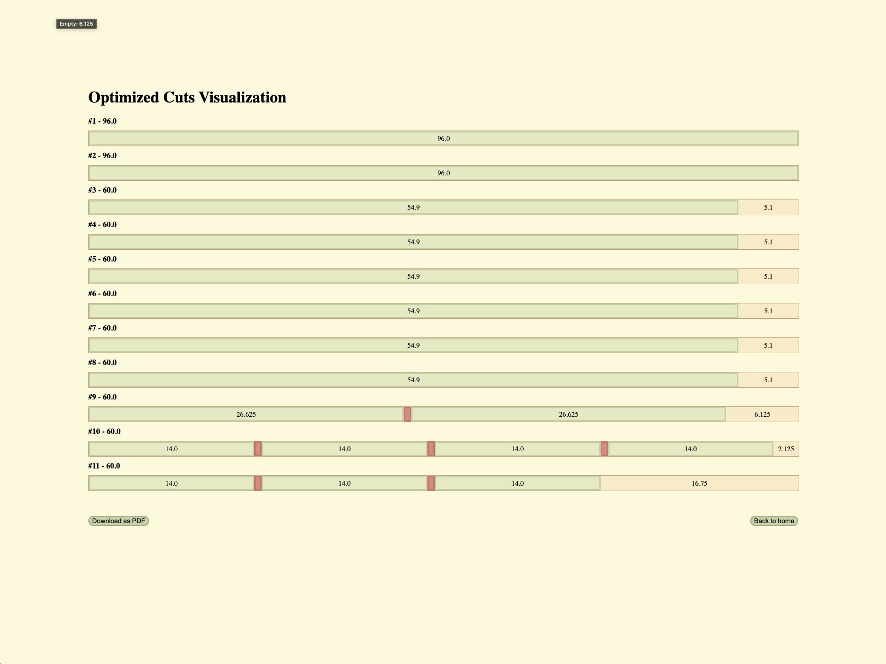

# Moulding Cutlist Optimizer

  

The **Moulding Cutlist Optimizer** is a web-based tool designed to reduce waste and minimize costs in trim and moulding projects by calculating the most efficient use of available material. Built entirely from scratch using **FastAPI**, **Jinja2**, and **vanilla JavaScript**, this app targets one-dimensional linear optimization with real-world geometry in mind—specifically crown moulding in complex room layouts.

With just a few inputs, users can generate a **graphical cut layout** and **export it as a PDF**, streamlining project planning from blueprint to build.

  

## Key Features

- **Material Input:** Define the size and quantity of your raw material and required pieces. Leave stock quantity empty to let the app calculate how much material is needed.
- **Precision Settings:** Include real-world factors like:
  - **Moulding Depth** — the projection of the trim from the wall.
  - **Blade Kerf** — the width of the saw cut.
  - **Exterior Corner Angles** — for accurate corner joints, especially with compound miters.
- **Visual Output:** Get a clear, interactive graphic showing each optimized cut across your raw material.
- **PDF Export:** Download a printable cutlist to share with installers or fabricators.

## What Went Well

- Designing and implementing the **best-fit algorithm** from the ground up, tailored to the unique geometry of crown moulding.
- Creating a clear **visual representation** of the optimized layout, which brings the data to life for users who may not be technically inclined.

## What Was Challenging

- Initially attempted to use **Jinja2 alone** to dynamically create and delete input rows, but ran into limitations. I pivoted to using **JavaScript** for cleaner, real-time form manipulation without needing page reloads.

## What I Learned

- Gained hands-on experience with **HTML form handling**, including how to correctly structure and process nested input data in Python using FastAPI.
- Improved my understanding of how front-end and back-end technologies interact in a full-stack Python web app.

## What I’d Like to Revisit

- **Database Integration:** Implementing **SQLite with SQLAlchemy** to store past cutlists, save templates, and possibly create user accounts.
- **Visual Polish:** Enhancing the user interface with more intuitive styling and responsive design for mobile and tablet users.

## Tech Stack

- **Backend:** Python, FastAPI, Uvicorn
- **Frontend:** HTML/CSS, Jinja2, JavaScript
- **PDF Generation:** WeasyPrint
- **Deployment:** Local testing (no database yet)

## Acknowledgments

This project is entirely original and represents my growing expertise in Python full-stack development. While I drew inspiration from industry problems and real-world workflows in trim carpentry, every line of logic and layout was designed by me, independently.
